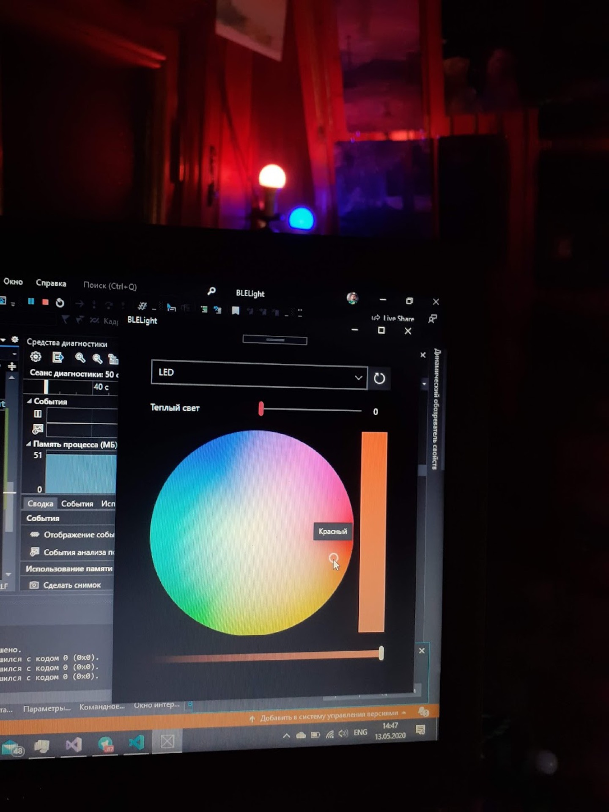

# BLE Smart Light

[](#overview)
[](#overview)
[%20%7C%20Android-0078D6.svg?logo=windows&logoColor=white)](#disclaimer--legacy-notice)
[](#-reverse-engineered-ble-protocol)
[-yellow.svg)](#disclaimer--legacy-notice)

A desktop and mobile controller for Bluetooth Low Energy (BLE) smart lamps, featuring a reverse-engineered GATT communication protocol for German Supra / Eboylight smart bulbs (RGB + CCT dual-white).


<p align="center">
  
</p>

---

> [!WARNING]
> ### Disclaimer & Legacy Notice
> Developed in **May 2020** targeting Windows 10 UWP (SDK 10.0.18362.0) and Xamarin.Android. This repository is archived for engineering reference and protocol documentation; it has not been tested on Windows 11 or modern Android versions.

---

## 💡 Origin & Background

In 2020, proprietary Bluetooth Low Energy smart lamps (marketed in Europe under brands like Supra and Eboylight) were only controllable via restricted, closed mobile apps with no official PC support or open APIs. 

By sniffing Bluetooth LE advertisement packets and reverse-engineering the GATT characteristics on an Android device, the proprietary 10-byte binary command protocol was uncovered. This enabled direct, local control over RGB colors, color temperature (warm vs. cold white), and brightness directly from a Windows 10 desktop via standard Bluetooth 4.0+ adapters without cloud dependencies or third-party bridges.

---

## 📡 Reverse-Engineered BLE Protocol

### Service & Characteristic UUIDs

| Function | UUID | Description |
| :--- | :--- | :--- |
| **Primary LED Service** | `0000cc02-0000-1000-8000-00805f9b34fb` | Core GATT service for lamp communication |
| **Color Write** | `0000ee03-0000-1000-8000-00805f9b34fb` | Write characteristic accepting 10-byte packets |
| **Color Read** | `0000ee01-0000-1000-8000-00805f9b34fb` | Read current lamp state, color, and temperature |
| **Handshake / Status** | `0000ee02-0000-1000-8000-00805f9b34fb` | Connection status and pairing state |
| **Advertisement Scan** | `ffffcc02-0000-1000-8000-00805f9b34fb` | Discovery service advertised in BLE beacons |

### 10-Byte Command Packet Structure

Commands sent to `UUID_COLOR_WRITE` follow a packed 10-byte array:

```
[0]   [1]   [2]   [3]   [4]   [5]   [6]   [7]   [8]   [9]
PWR    G    WM1   C-W   MOD    B    MOD    R    WM2   W-W
```

- **Byte `0`**: Power / packet valid flag (`0x01`)
- **Byte `1`**: Green channel intensity (`0–255`)
- **Byte `2`**: Dual-white mode flag 1 (`0x01` when warm white active, `0x00` for RGB)
- **Byte `3`**: Cold White intensity (`0–255`)
- **Byte `4`**: Transmission mode marker (`0x01`)
- **Byte `5`**: Blue channel intensity (`0–255`)
- **Byte `6`**: Transmission mode marker (`0x01`)
- **Byte `7`**: Red channel intensity (`0–255`)
- **Byte `8`**: Dual-white mode flag 2 (`0x01` when warm white active, `0x00` for RGB)
- **Byte `9`**: Warm White intensity (`0–255`)

---

## 🛠️ Components & Architecture

### 1. `windows-uwp/` — Windows 10 UWP Application
- Built with C# and Universal Windows Platform APIs (`Windows.Devices.Bluetooth`).
- **`BLEClient.cs`**: Implements `BluetoothLEAdvertisementWatcher` with signal strength threshold filtering (`-70 dBm` in-range, `-75 dBm` out-of-range), GATT connection lifecycle, and RGB/CCT byte packet serialization.
- **`MainPage.xaml`**: Fluent UI with:
  - Circular hue/saturation spectrum ring (`ColorPicker ColorSpectrumShape="Ring"`).
  - Warm white slider with live percentage feedback.
  - Device picker dropdown with auto-discovery and instant reconnect.

### 2. `android-xamarin/` — Android Companion
- Early mobile prototype built with Xamarin.Android and Android Support libraries.
- Implements material drawer navigation and Bluetooth device binding.

---

## 📁 Repository Layout

```
ble-smart-light/
├── windows-uwp/              # Primary Windows 10 UWP client
│   ├── BLELight.sln          # Visual Studio solution
│   └── BLELight/
│       ├── BLEClient.cs      # Core GATT driver & packet encoder
│       ├── LampColor.cs      # Color state model
│       ├── MainPage.xaml     # Fluent UI view (ColorPicker + Warm slider)
│       └── MainPage.xaml.cs  # UI event handlers & device dispatcher
└── android-xamarin/          # Experimental Android mobile port
    ├── BLE Smart Light.sln   # Xamarin solution
    └── BLE Smart Light/      # Android activity & layouts
```
